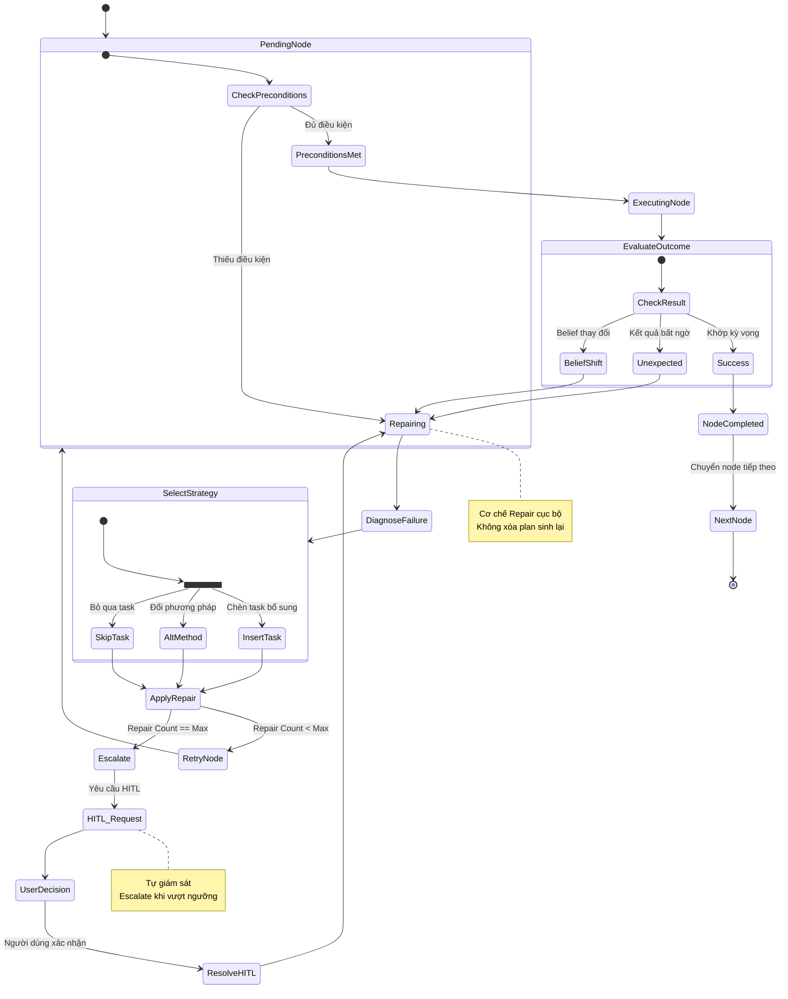

```mermaid
stateDiagram-v2
    [*] --> PendingNode

    state PendingNode {
        [*] --> CheckPreconditions
        CheckPreconditions --> PreconditionsMet : Đủ điều kiện
        CheckPreconditions --> Repairing : Thiếu điều kiện
    }

    PreconditionsMet --> ExecutingNode

    ExecutingNode --> EvaluateOutcome

    state EvaluateOutcome {
        [*] --> CheckResult
        CheckResult --> Success : Khớp kỳ vọng
        CheckResult --> Unexpected : Kết quả bất ngờ
        CheckResult --> BeliefShift : Belief thay đổi
    }

    Success --> NodeCompleted
    NodeCompleted --> NextNode : Chuyển node tiếp theo
    NextNode --> [*]

    Unexpected --> Repairing
    BeliefShift --> Repairing

    note right of Repairing
        Cơ chế Repair cục bộ
        Không xóa plan sinh lại
    end note

    Repairing --> DiagnoseFailure
    DiagnoseFailure --> SelectStrategy

    state SelectStrategy {
        state fork_state <<fork>>
        [*] --> fork_state
        fork_state --> InsertTask : Chèn task bổ sung
        fork_state --> AltMethod : Đổi phương pháp
        fork_state --> SkipTask : Bỏ qua task
    }

    InsertTask --> ApplyRepair
    AltMethod --> ApplyRepair
    SkipTask --> ApplyRepair

    ApplyRepair --> RetryNode : Repair Count < Max
    ApplyRepair --> Escalate : Repair Count == Max

    RetryNode --> PendingNode

    Escalate --> HITL_Request : Yêu cầu HITL

    note right of HITL_Request
        Tự giám sát
        Escalate khi vượt ngưỡng
    end note

    HITL_Request --> UserDecision
    UserDecision --> ResolveHITL : Người dùng xác nhận
    ResolveHITL --> Repairing
```
