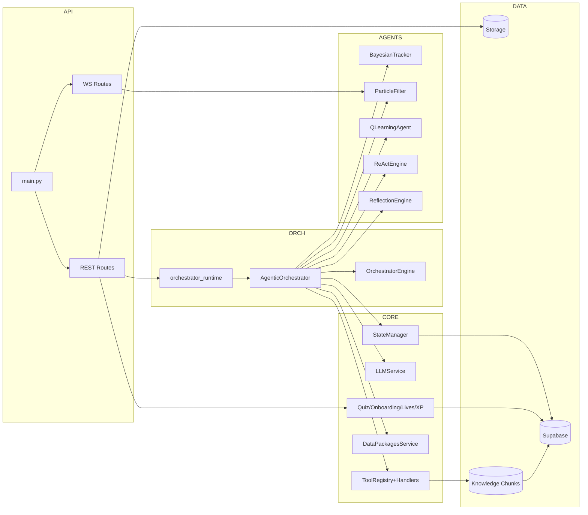
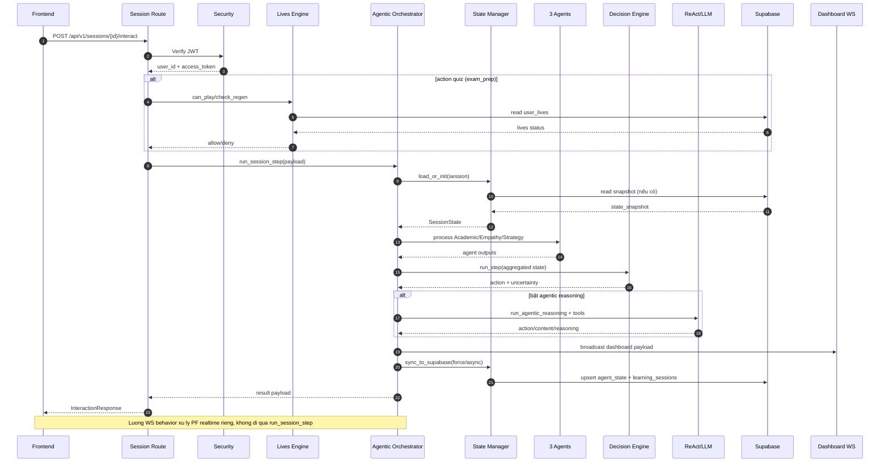
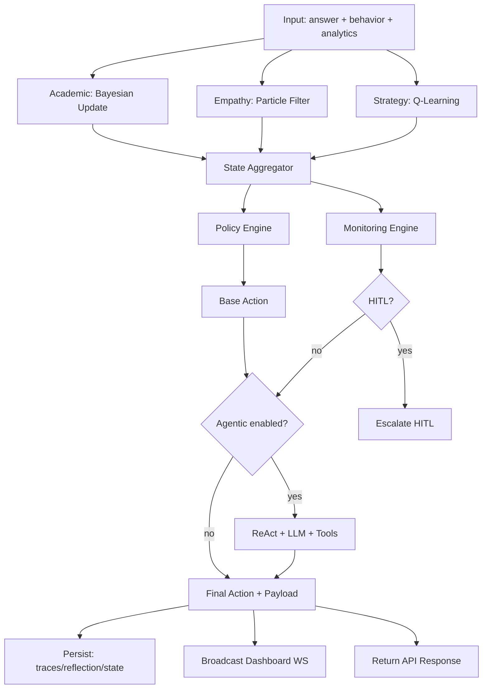
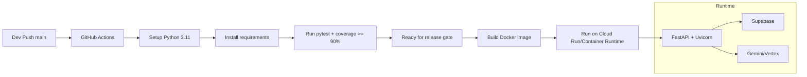

# SYSTEM_DESIGN

Tài liệu này ưu tiên mã chạy thực tế trong `backend/`, migration SQL, và workflow CI hiện có.
Không dùng tài liệu mô tả cũ làm nguồn chính.

## 1. Tổng quan Kiến trúc Hệ thống (High-Level Architecture)

- Backend dùng FastAPI làm lớp API đồng bộ giữa client, hệ AI đa tác tử và Supabase.
- Client giao tiếp bằng REST + WebSocket.
- REST xác thực bằng Bearer JWT qua Authorization header.
- WebSocket xác thực bằng Bearer JWT (Authorization header; hỗ trợ `access_token`/`token` query param cho client tương thích).
- Dữ liệu phiên học, tiến độ quiz, XP, hồ sơ người dùng, trace suy luận được lưu ở Supabase Postgres.
- Luồng AI gồm 2 lớp:
- Lớp quyết định tất định: Bayesian + Particle Filter + Q-Learning + HTN Planner + Policy/Monitoring Engine.
- Lớp suy luận tác tử (tùy chọn): ReAct + LLM (Gemini qua `google-genai`) + tool-calling.
- Dữ liệu tri thức dùng RAG với `knowledge_chunks` + RPC `match_knowledge_chunks`.
- WebSocket dashboard phát trạng thái thời gian thực để quan sát nội bộ orchestrator.

```mermaid
flowchart TD
    C1[Client Mobile/Web] -->|HTTPS REST| A1[FastAPI API]
    C1 -->|WebSocket| A2[WS Behavior]
    C1 -->|WebSocket| A3[WS Dashboard]

    A1 --> S1[Security JWT + HMAC]
    A1 --> O1[Orchestrator Runtime]
  A2 --> T1[Realtime PF Telemetry]

    O1 --> D1[State Manager]
    O1 --> D2[Decision Engine]
    O1 --> D3[AI Agents]
    O1 --> D4[LLM Service]

    D1 --> B1[(Supabase Postgres)]
    D4 --> G1[Gemini Model]
  D4 --> G2[Google Search Tool (Chatbot)]
    D3 --> R1[RAG Retriever]
    R1 --> B1
  T1 --> A2

    A3 --> C1
```

## 2. Các Thành phần Cốt lõi (Core Components)

- Lớp API và điều phối request:
- `backend/main.py`: khởi tạo FastAPI, CORS, router REST, router WebSocket, startup validation dữ liệu.
- `backend/api/routes/*.py`: các domain API (session, session_recovery, quiz, chatbot, leaderboard, lives, onboarding, user_profile, orchestrator, inspection, configs...).
- `backend/api/ws/*.py`: telemetry hành vi và stream dashboard (đều yêu cầu Bearer token).

- Lớp điều phối phiên học:
- `backend/api/routes/orchestrator_runtime.py`: tạo/caching orchestrator theo session (LRU).
- `backend/agents/orchestrator.py`: pipeline chính của mỗi bước học, hợp nhất agent output, chọn action cuối, phát dashboard, lưu state.
- `backend/orchestrator/*.py`: engine tất định gồm aggregator, policy, monitoring.

- Lớp AI chuyên trách:
- `BayesianTracker`: theo dõi giả thuyết hổng kiến thức H01-H04.
- `ParticleFilter`: ước lượng confusion/fatigue/uncertainty từ tín hiệu hành vi và analytics.
- `QLearningAgent`: học chính sách hành động theo trạng thái rời rạc.
- `HTNPlanner`: lập kế hoạch nghiệp vụ phân cấp (Hierarchical Task Network) đảm bảo fallback hoặc workflow đa bước.
- `ReActEngine` + `LLMService`: suy luận tool-calling khi bật chế độ agentic.
- `ReflectionEngine`: tự phản tư định kỳ để đề xuất đổi chiến lược.

- Lớp nghiệp vụ và dữ liệu:
- `StateManager`: cache state, phục hồi snapshot, autosave theo chu kỳ và theo sự kiện.
- `supabase_client.py`: gateway dữ liệu, retry/timeout, user-scoped token.
- `quiz_service.py`, `onboarding_service.py`, `lives_engine.py`, `xp_engine.py`, `formula_*`, `question_selector.py`: nghiệp vụ học tập.
- `memory_store.py`, `runtime_alerts.py`, `user_classifier.py`, yếu tố `reward_engine.py`: hỗ trợ phân loại người dùng, tính phần thưởng, quản trị trạng thái lưu trữ dài hạn và giám sát cảnh báo.
- `data_packages.py`: nạp và kiểm định package diagnosis/intervention/runtime trước khi hệ thống chạy.
- Các bảng được code truy cập trực tiếp:
- `learning_sessions`, `agent_state`, `quiz_question_attempts`, `user_profiles`.
- `user_token_usage`, `user_xp`, `user_lives`, `user_badges`.
- `episodic_memory`, `reasoning_traces`, `session_reflections`, `chat_history`, `q_table`.
- `knowledge_chunks` (kèm RPC `match_knowledge_chunks`), `audit_logs`.
- Supabase Storage được dùng cho ảnh chatbot (`CHAT_IMAGE_BUCKET`) thay vì StateManager.



## 3. Luồng dữ liệu và API (Data Flow & API Endpoints)

- Mô hình giao tiếp chính:
- Frontend gọi REST để tạo phiên, làm quiz, tương tác AI, đọc hồ sơ, leaderboard.
- Frontend dùng WebSocket để gửi tín hiệu hành vi và nhận stream dashboard thời gian thực.
- WS `/ws/v1/behavior/{session_id}` xử lý telemetry bằng Particle Filter thời gian thực, độc lập với pipeline orchestrator theo REST.
- WS dashboard và behavior đều yêu cầu Bearer token.

- Các endpoint trọng tâm theo domain:
- Phiên học:
- `POST /api/v1/sessions`
- `PATCH /api/v1/sessions/{session_id}`
- `GET /api/v1/sessions/pending`
- `POST /api/v1/sessions/{session_id}/interact`
- Quiz:
- `GET /api/v1/quiz/next`
- `POST /api/v1/quiz/submit` (có kiểm tra chữ ký HMAC)
- `GET /api/v1/quiz/sessions/{session_id}/result`
- `GET /api/v1/quiz/history`
- Chatbot:
- `POST /api/v1/chatbot/chat`
- `POST /api/v1/chatbot/chat/image`
- `POST /api/v1/chatbot/chat_with_image`
- `GET /api/v1/chatbot/history`
- `DELETE /api/v1/chatbot/history`
- Orchestrator và công thức:
- `POST /api/v1/orchestrator/step`
- `GET /api/v1/formulas`
- Người dùng và gamification:
- `GET /api/v1/user/profile`, `PUT /api/v1/user/profile`
- `GET /api/v1/leaderboard`, `GET /api/v1/leaderboard/me`
- `POST /api/v1/xp/add`, `GET /api/v1/badges`
- Lives và onboarding:
- `GET /api/v1/lives`, `POST /api/v1/lives/lose`, `POST /api/v1/lives/regen`
- `GET /api/v1/onboarding/questions`, `POST /api/v1/onboarding/submit`
- Quan sát nội bộ:
- `GET /api/v1/inspection/*`
- `GET /api/v1/quota` và `GET /api/v1/chatbot/quota`
- `GET /api/v1/session/pending` (alias phục vụ recovery)
- `GET /api/v1/configs/{category}`, `POST /api/v1/configs/{category}`
- `WS /ws/v1/behavior/{session_id}`
- `WS /ws/v1/dashboard/stream` và `WS /ws/v1/dashboard/stream/{session_id}`
- Hạ tầng:
- `GET /health`

- Ghi chú phạm vi nghiệp vụ:
- Backend hiện tại không có endpoint chuyên biệt cho "time-slot sự kiện"; luồng chính tập trung vào học tập, quiz, chatbot, tiến độ và telemetry.



## 4. AI Pipelines & Tooling (Quy trình và Công cụ AI)

- Pipeline AI trong một bước tương tác:
- Nhận input gồm câu trả lời, tín hiệu hành vi, analytics, mode học.
- Luồng WS behavior song song: xử lý tín hiệu realtime bằng Particle Filter để đề xuất intervention nhanh, không ghi trực tiếp orchestrator state snapshot.
- Academic Agent cập nhật belief theo Bayes từ evidence.
- Empathy Agent chạy Particle Filter để tính confusion/fatigue/uncertainty và gợi ý override khi rủi ro cao.
- Strategy Agent chạy Q-Learning để chọn hành động theo trạng thái rời rạc.
- Kế hoạch động hoặc fallback an toàn có thể gọi thông qua HTN Planner (dùng `HTNNode`, `HTNUtils`, `HTNExecutor`, `HTNPlanner`).
- Orchestrator Engine hợp nhất state embedding, tính utility, và giám sát ngưỡng bất định để kích hoạt HITL.
- Nếu bật agentic mode, ReAct dùng LLM + tool-calling để tinh chỉnh action/content.
- Tạo payload data-driven từ diagnosis/intervention package.
- Lưu reasoning trace, reflection, episodic memory, q_table và snapshot phiên.

- Tooling và thư viện AI/dữ liệu liên quan:
- `google-genai`: gọi Gemini (text + vision + function-calling).
- Google Search grounding hiện dùng trong luồng chatbot; agentic orchestrator dùng ToolRegistry nội bộ (`get_*`, `search_knowledge`).
- `google-cloud-aiplatform` + `vertexai.language_models`: embedding cho RAG.
- `numpy`: tính toán cho PF và Q-Learning.
- `supabase-py`: đọc/ghi dữ liệu và RPC `match_knowledge_chunks`.
- `PyJWT` + `PyJWKClient`: xác thực JWT theo JWKS.
- `yaml`, `json`: nạp cấu hình tác tử và data package.

- Các tool trong agentic reasoning:
- `get_academic_beliefs`
- `get_empathy_state`
- `get_strategy_suggestion`
- `get_student_history`
- `get_formula_bank`
- `get_orchestrator_score`
- `search_knowledge` (khi retriever sẵn sàng)



## 5. Triển khai & CI/CD (Deployment & Tooling - Optional)

- Runtime và đóng gói:
- Docker multi-stage trên `python:3.11-slim`.
- Chạy `uvicorn main:app --host 0.0.0.0 --port ${PORT:-8080}`.
- Chạy non-root user trong container.
- Startup fail-fast nếu `DataPackagesService` không hợp lệ.

- Chất lượng mã và kiểm thử:
- Ruff được cấu hình trong `backend/pyproject.toml`.
- Test dùng `pytest`, `pytest-asyncio`, `pytest-cov`.
- Bộ test bao phủ unit, integration, orchestrator, empathy, strategy, benchmark.

- CI/CD & Deploy hiện có:
- Kiểm thử (GitHub Actions): Workflow `.github/workflows/backend-test.yml` chạy khi push `main` và `workflow_dispatch` để cài dependency, chạy `pytest` với coverage gate tối thiểu 90%.
- Triển khai (Cloud Build / Cloud Run Integration): Chế độ Continuous Deployment được cấu hình trực tiếp với Google Cloud Run. Hệ thống tự động kích hoạt tiến trình build Docker image và deploy dịch vụ mỗi khi có commit mới vào nhánh `main` (hiển thị dưới dạng status check trên GitHub).

- Biến môi trường chính:
- Supabase: `SUPABASE_URL`, `SUPABASE_KEY`, JWT issuer/JWKS/audience.
- LLM/GCP: `GCP_PROJECT_ID`, `GCP_LOCATION`, `VERTEX_MODEL_NAME`.
- Agentic controls: `USE_LLM_REASONING`, `AGENTIC_MAX_STEPS`, `AGENTIC_TIMEOUT_MS`.
- Runtime safety: ngưỡng HITL, chữ ký quiz, webhook runtime alerts.

- Điểm cần lưu ý khi triển khai:
- `pyproject.toml` đang ghi `requires-python >=3.13` trong khi Docker/CI dùng 3.11.
- CORS hiện cho phép toàn bộ origin, cần siết lại ở môi trường production.


